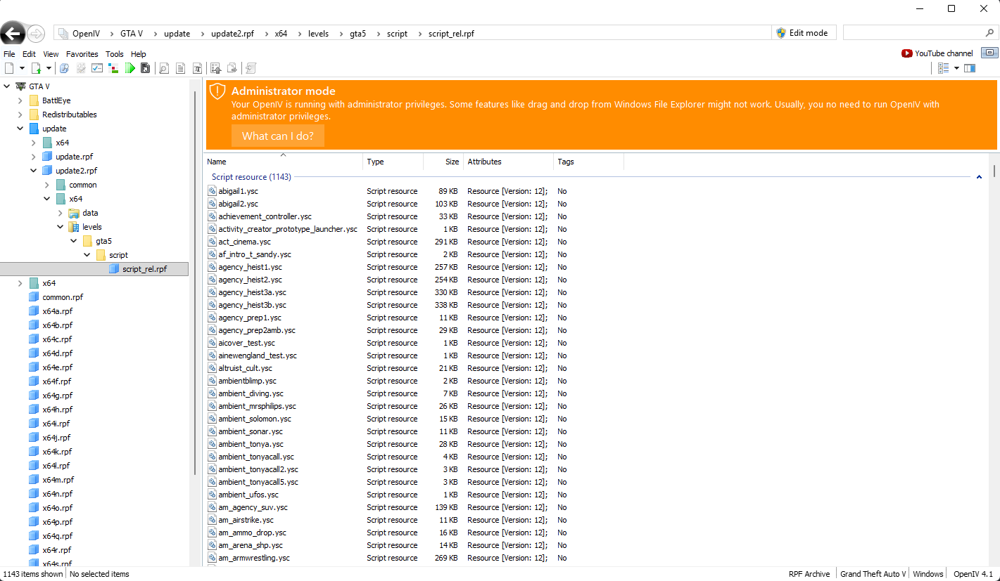
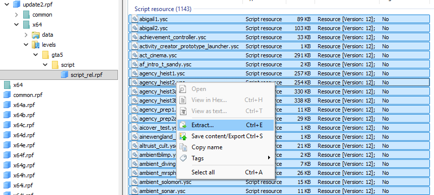

# YSC Global Updater

**Turn a fresh GTA V script dump into an up-to-date `offsets.ini` — automatically.**

After every GTA update the decompiled scripts change: structs grow and new fields
get inserted, so the `Global_*` offsets in your `offsets.ini` point to the wrong
place and the menu breaks. This tool reads the **old** and the **new** decompiled
scripts and rewrites `offsets.ini` for you.

> New scripts in → checked `offsets.ini` out.

For a typical update it sets **~98 % of all offsets automatically**, lists the
handful of leftovers for a quick manual check, runs in **~1 minute**, uses
**~200 MB RAM**, and **never touches your original `offsets.ini`**.

---

## Requirements

| Tool | Why | Install |
|---|---|---|
| **Python 3.10+** | runs the updater (no pip packages needed) | [python.org](https://www.python.org/) |
| **ripgrep (`rg`)** | fast, low-memory script scanning | `sudo apt install ripgrep` · `winget install BurntSushi.ripgrep.MSVC` |
| **`curl`** | download the ready-made decompiled scripts (Option A) | pre-installed on macOS/Linux and modern Windows |
| **OpenIV** | *only if you decompile yourself* (Option B) | [openiv.com](https://openiv.com/) |
| **a GTA V script decompiler** | *only if you decompile yourself* (Option B) | see Step 1 · Option B |

Check Python and ripgrep are ready:

```bash
python3 --version
rg --version
```

---

## Step-by-step

### Step 1 — Get the decompiled scripts

The updater compares two sets of decompiled `.c` scripts:

- **`old/`** — the game version your current `offsets.ini` was built for
- **`new/`** — the new game version you want to update to

You only need **8 files** in each folder (the creator/launcher scripts). There are
two ways to get them.

---

#### Option A — Download them (recommended, no OpenIV needed)

The community repo **[calamity-inc/GTA-V-Decompiled-Scripts](https://github.com/calamity-inc/GTA-V-Decompiled-Scripts)**
publishes the decompiled scripts (with native tables) for every GTA build and keeps
the git history for older versions.

**First, check it's current:** open the repo and look at the latest commit on the
`decompiled_scripts` folder — if it says your target build (e.g. *"Update for
1.72-…"*), you're set. If it's behind your build, use Option B instead.

**Download the 8 files for the NEW version** — copy-paste this:

```bash
cd /opt/ysc-global-updater
mkdir -p new
base="https://raw.githubusercontent.com/calamity-inc/GTA-V-Decompiled-Scripts/master/decompiled_scripts"
for f in fm_capture_creator fm_deathmatch_creator fm_lts_creator fm_race_creator \
         fm_survival_creator fmmc_launcher public_mission_creator tuneables_processing; do
  echo "-> $f.c"
  curl -fSL "$base/$f.c" -o "new/$f.c"
done
```

**For the OLD version:** you almost certainly already have `old/` — it's the build
your current `offsets.ini` matches, so just reuse last time's files. If you really
need to rebuild it, open the repo's
[commit history for `decompiled_scripts`](https://github.com/calamity-inc/GTA-V-Decompiled-Scripts/commits/master/decompiled_scripts),
find the commit whose message matches your old build (e.g. *"Update for 1.71-…"*),
copy its commit hash, and run the same loop with `master` → that hash and `new` → `old`:

```bash
cd /opt/ysc-global-updater
mkdir -p old
ref="PASTE_COMMIT_HASH_HERE"   # from the commit history, matching your old build
base="https://raw.githubusercontent.com/calamity-inc/GTA-V-Decompiled-Scripts/$ref/decompiled_scripts"
for f in fm_capture_creator fm_deathmatch_creator fm_lts_creator fm_race_creator \
         fm_survival_creator fmmc_launcher public_mission_creator tuneables_processing; do
  echo "-> $f.c"
  curl -fSL "$base/$f.c" -o "old/$f.c"
done
```

When both folders are filled, **skip to [Step 2](#step-2--run-the-updater)**.

---

#### Option B — Decompile them yourself

Use this only if the repo isn't updated for your build yet.

**B1 — Export the scripts with OpenIV**

The game ships the scripts as a packed archive. Open it in OpenIV and export the
raw script container.

1. Start **OpenIV** and open your GTA V install.
2. Go to `update` → `update.rpf` → `x64` → `levels` → `gta5` → `script` → `script.rpf`.
   - On newer game versions the scripts live in **`update2.rpf`** instead:
     `update` → `update2.rpf` → `x64` → `levels` → `gta5` → `script` → `script.rpf`.
     If `update.rpf` has no `script.rpf` (or looks empty), use `update2.rpf`.
3. Select **all** files (`Ctrl+A`), then **right-click → Extract…** (`Ctrl+E`).
   Exporting everything is easiest and future-proof; the updater picks the files
   it needs by itself.
   
4. Choose an empty folder, e.g. `dump_new_raw/`. You now have a folder full of
   `.ysc` files.
   

**B2 — Decompile (`.ysc` → `.c`)**

OpenIV gives you raw `.ysc` containers. Convert them to readable C-like code with
a script decompiler that uses the current **native tables**.

1. Get a GTA V script decompiler (e.g. a Sysenv / `ysc` decompiler build).
2. Point it at the **native table** for the game build you exported (the decompiler
   downloads/ships these; make sure it matches the build).
3. Decompile the whole folder. You get one `.c` file per script
   (`fm_capture_creator.c`, `fmmc_launcher.c`, …).


Then copy the decompiled `.c` files into `old/` (your current build) and `new/`
(the new build):

```bash
cp /path/to/dump_old/*.c  old/
cp /path/to/dump_new/*.c  new/
```

> Only the 8 creator/launcher scripts are needed, but copying the whole dump is
> fine — the updater selects the relevant ones automatically.

### Step 2 — Run the updater

One command does everything (select → migrate → summary):

```bash
python3 tools/run_pipeline.py --old-dir old --new-dir new --offsets offsets.ini
```

You get a formatted summary at the end:

```
========================================================================
  MIGRATION SUMMARY
========================================================================
  Result          : reports/offsets.migrated.ini   (your original offsets.ini is untouched)
------------------------------------------------------------------------
  [ OK ]     migrated automatically  : 889
  [ OK ]     unchanged / still valid : 45
  [ -- ]     static constants        : 56   (hex / coords, not script offsets)
  [REVIEW]   need a manual look      : 12
------------------------------------------------------------------------
  These offsets changed but could NOT be resolved automatically.
  Open the result file and set them by hand:
      OFFSET_transitionState             old = Global_2696496
      OFFSET_check_creator               old = Global_1921391
      ...
========================================================================
  889 migrated automatically, 12 need your attention.
========================================================================
```

- The updated file is `reports/offsets.migrated.ini` — review it, then copy it
  over your `offsets.ini` when happy.
- The **REVIEW** list is the only thing you may need to touch by hand (usually a
  small handful of special globals). Full details are in
  `reports/migrate-report.json`.

Optional flags:

```bash
# also score the result against a known-good offsets.ini (per-family confidence)
python3 tools/run_pipeline.py --old-dir old --new-dir new --offsets offsets.ini \
    --expect known_good_offsets.ini

# also run the slow context-matcher for the very last gaps (minutes, optional)
python3 tools/run_pipeline.py --old-dir old --new-dir new --offsets offsets.ini --infer
```

> Tip: put the **full** new dump in `new/` (not just the 8 creator files). The
> summary then also verifies globals that live in other scripts (e.g. the
> `published_*` / `saved_*` block) and will not list them for review by mistake.

---


## Adding a new offset

To track a **new** global or local, add one line to your `offsets.ini` (the file
for your *current* version) and re-run the updater — the migrator resolves the new
value to the next version automatically. Write the value exactly as the decompiler
names it in your current dump:

| What you found | Line to add | What migration does |
|---|---|---|
| a **global** field | `OFFSET_myname = "Global_993502.f_4.f_90"` | follows the stable DATADICT/container name, then structural |
| a **local** (whole struct) | `OFFSET_myname = "uLocal_9223"` | context-matches the local (string/native/struct/switch anchors) |
| a **local field** | `OFFSET_cmxdftms = "uLocal_9223.f_808"` | resolves the local **and** the field → `uLocal_9307.f_814` |
| a **field** of an existing container | `OFFSET_myname = "f_808"` | migrated relative to its `worker`/`pre` struct |

Notes:

- The **name** (`OFFSET_...`) is yours to choose; it does not need a
  `_survival`/`_capture` suffix — for a plain local the tool finds the creator
  script the local lives in by itself.
- Use the **type prefix** the decompiler shows (`uLocal_`, `iLocal_`, `fLocal_`);
  it is preserved. Bare `Local_N` works too.
- Anything the tool cannot resolve is listed under **REVIEW** rather than guessed,
  so a typo or a value that is not actually in the scripts is easy to spot.

---


## How it works

The updater never guesses blindly. It uses **stable names** wherever possible and
only falls back to structural inference for the rest, in this order:

1. **Semantic path (names).** Most globals are serialized with a stable string
   key — either a DATADICT key (`DATADICT_SET_INT(dict, "trntype", Global_…)`) or
   a container name built with `StringCopy(&v,"armr")` + `DATADICT_CREATE_ARRAY`.
   The raw `Global_*` number moves every update, the **name** does not, so the new
   value is a direct lookup. This is exact and version-robust (no hard-coded
   function numbers).
2. **Structural resolver** (`structural.py`) for code-only fields (veh/actor/pa/…):
   it derives the root shift, stride refresh and the leaf/scalar *step function*
   from the scripts themselves (rg-prefiltered, so it stays memory-safe).
3. **Helper-name fallback** (`helper_names.py`) for fields whose only name comes
   from a serializer helper `func_N("key", Global_…)` — resolved via **unique**
   keys only.
4. **infer** (`infer_offsets.py`, optional `--infer`): slow context-matcher for
   the very last gaps.

Local variables (the `current_creator_*` offsets, values like `fLocal_7143`) are
handled by a dedicated context matcher (`locals.py`). Locals have no stable name
and their stack index moves every update, so it anchors on what *is* stable
around them — string constants, native calls, `struct<N>` initializers and
`switch` bodies — to find the same variable in the new script. It resolves all
six creator modes (survival/capture/lts/mission/dm/race) automatically; the
resulting index deltas grow monotonically with the stack index, which is a
built-in sanity check.

Some offsets are a **field inside** such a local — e.g. `worker_offset_refresh`
is `worker.f_562`, read from the already-resolved worker struct. When the struct
is rebuilt the field number shifts (`f_562 → f_565`). Each field is resolved
against the struct it actually lives in (the `pre_*` fields are split across the
worker *and* pre structs, auto-detected by direct access) using two signals: a
layout-wide **field alignment** (all accessed field numbers of the struct, old vs
new, like the global aligner) and the field's **access context** (assignment/
compare constant like `= 94`, enclosing `switch`, adjacent natives). Fields only
reached indirectly fall back to step-interpolation from the struct layout.

> **Speed.** The expensive name→`Global` scan (`build_maps`, ~1–2 min over all
> scripts) is cached to disk under `reports/.cache/` keyed by file size+mtime, and
> the cold scan runs file-parallel. Re-runs on unchanged scripts skip it entirely.
> Pass `--no-cache` to force a fresh scan.

Anything still unresolved is listed in the summary for a manual look — the tool
never writes a value it is not confident about.

## The tools (`tools/`)

| Tool | Job |
|---|---|
| `select_sources.py` | picks the relevant creator/launcher scripts from the dump (`reports/sources.keep.txt`) |
| `extract_globals.py` | builds `name → Global` maps (DATADICT keys, container names, `func_N()` unwrap) |
| `structural.py` | structural resolver for code-only families (root/stride/leaf/scalar step functions) |
| `locals.py` | context matcher for `current_creator_*` locals + their struct fields (string/native/struct-init/switch/constant anchors) |
| `helper_names.py` | name fallback via `func_N(key, global, …)` call-sites (unique keys only) |
| `migrate_offsets.py` | migrates one `offsets.ini`: semantic first → structural → helper → (optional infer) |
| `validate.py` | scores a result against a known-good `offsets.ini`, with a per-family breakdown |
| `run_pipeline.py` | the one-command entry point (Step 2) + the formatted summary |
| `infer_offsets.py` | legacy pattern/context matcher (optional deep fallback) |

Run the individual migration by hand if you want more control:

```bash
python3 tools/migrate_offsets.py \
    --ini offsets.ini --old-dir old --new-dir new \
    --structural --out reports/offsets.migrated.ini --report-json reports/migrate-report.json
```

The original `offsets.ini` is **never** modified — output always goes to `reports/`.

## Tests

```bash
python3 -m unittest discover -s tests
```

(Run the light modules individually if your `new/` holds the full multi-GB dump:
`python3 -m unittest tests.test_migrate_offsets tests.test_structural tests.test_helper_names tests.test_extract_globals tests.test_validate`.)

## Accuracy & limits (honest)

- On a real `v1.71 → current` update the tool sets **~98 % of all globals**
  correctly and lists the rest.
- Some entries it "disagrees" on are actually **errors in the hand-made
  `offsets.ini`**, not tool errors: for `veh_objt2` three independent methods and
  the script's own serialization all say `f_222` while a hand-edited reference had
  `f_221`. The value the tool writes is the one the script actually serializes.
- The genuine leftovers are a small handful of **name-less bare globals**
  (e.g. `transitionState`, `check_creator`) that live in one-line setters with no
  name and no native context — even mature tools special-case these. They show up
  in the **REVIEW** list; set them once by hand.
- Static constants (teleport coords like `8,30,50`, hex like `0x60`) are not
  script offsets and are left untouched on purpose.

## Troubleshooting

- **`rg: command not found`** — install ripgrep (see Requirements). It is required
  for the memory-safe scanning.
- **The REVIEW list contains `published_*` / `saved_*`** — those globals live in
  scripts outside the 8 creator files. Put the **full** new dump in `new/` and the
  summary can verify them (they are stable and drop off the list).
- **High RAM / slow** — make sure you are on the default `--structural` path
  (via `run_pipeline.py`); only `--infer` is slow. The structural path is
  rg-prefiltered and stays around ~200 MB.


