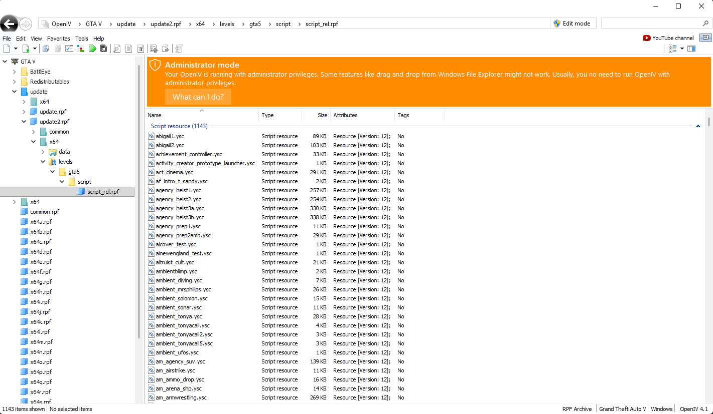
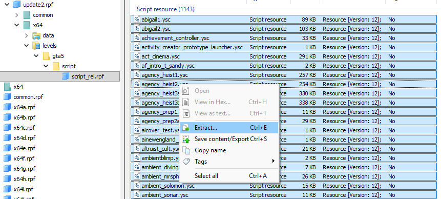

# YSC Global Updater

Turns a fresh GTA V script dump into an up-to-date `offsets.ini`.

Every GTA update shifts the `Global_*` memory offsets: structs grow, fields get
inserted, and the offsets in `offsets.ini` point at the wrong place. This tool
compares the old and the new decompiled scripts and rewrites the file for you.
Your original `offsets.ini` is never modified — output goes to `reports/`.

> Uses the prebuilt decompiled scripts published by
> [calamity-inc](https://github.com/calamity-inc/GTA-V-Decompiled-Scripts).
> If that repo has not caught up with your build yet, see
> [Appendix — decompile the scripts yourself](#appendix--decompile-the-scripts-yourself).

## Requirements

- Python 3.10+ (no pip packages)
- ripgrep — `sudo apt install ripgrep` / `winget install BurntSushi.ripgrep.MSVC`
- curl

## The whole update

One command runs the whole chain and asks before every step that writes
something:

```bash
python3 update_xenvious.py --new 1.74-4012                      # Legacy
python3 update_xenvious.py --variant enhanced --new 1.74-1200   # Enhanced
python3 update_xenvious.py --new 1.74-4012 --dry-run            # report only
```

```text
 1  Fetch the build       ./fetch_update.sh
 2  Migrate offsets       tools/run_pipeline.py
 3  Check/repair patterns scrpatches/update_patches.py
 4  Repair payloads       scrpatches/repair_scrpatches.py
 5  Deploy                Xenvious/OfflineData/<variant>/{offsets.ini,scrpatches.json}
 6  Rebuild               reminder only — OfflineData is compiled into the .exe
```

Each step first reports what it finds. A step whose output is already newer than
its inputs is reported as up to date and is not offered again, so re-running the
command after an interruption picks up where it left off. Step 5 refuses to run
while any pattern is still broken.

Rollback is git: `git checkout -- Xenvious/OfflineData` in the Xenvious
checkout. The script writes no `.bak` files.

The sections below document the individual tools, for when a step needs a
closer look or a non-default argument. Scripts are stored per build under
`scripts/<build>/`, so you compare versions by name.

> Steps 3 and 4 belong to the **runtime bytecode patches** (`scrpatches.json` —
> dev mode, cam fix, the injected custom functions). Separate problem, separate
> toolchain, separate runbook: [`scrpatches/README.md`](scrpatches/README.md).
> `fetch_update.sh` pulls the inputs for both.

`--old` defaults to the previous build in `scripts/`. If your `offsets.ini` lags
a version, pass `--old <build>` explicitly — a wrong guess shows up immediately
as a very low "migrated" count.

## Legacy and Enhanced

GTA V ships as two separate games that can be installed side by side. They share
their script *content* — the same missions, the same creators, the same Online
version — but they are compiled separately, so **no address is valid in both**.
Offsets, AOB patterns and bytecode patches all have to exist twice.

Builds are kept apart by a label prefix, and the tools never compare across it:

```text
scripts/1.73-3889/              Legacy   (calamity-inc)
scripts/enhanced-1.73-1158/     Enhanced (acidlabsdev)
```

An unprefixed label means Legacy, so everything from before the split keeps its
meaning. The two are numbered independently — Enhanced build 1158 is newer than
Legacy build 3889 — which is why `versions.previous()` stays inside a variant.
Without that, `--old` would default to the other game.

| | Legacy | Enhanced |
|---|---|---|
| Upstream for `.c` | [calamity-inc](https://github.com/calamity-inc/GTA-V-Decompiled-Scripts) | [acidlabsdev](https://github.com/acidlabsdev/gtav-enhanced-scripts) |
| Upstream for `.ysc.full` | calamity-inc | none — extracted locally |
| Offsets | migrated | migrated |
| scrpatches | verified against bytecode | verified against bytecode |
| AOB patterns | complete | 2 of 17 derived |

### What works for Enhanced

**Offsets.** The migration is source-based, so it works the same for both. The
first Enhanced run is bootstrapped from the freshly migrated Legacy result —
the games share their script content, so that is the closest starting point
that exists. Later runs go Enhanced-to-Enhanced like any other update.

To check the result, score each ini against both corpora. Each one should fit
its own game best; if it does not, `--old` named the wrong build:

```bash
python3 tools/score_corpus.py --ini reports/offsets.migrated.enhanced.ini \
    --corpus scripts/enhanced-1.73-1158 --corpus scripts/1.73-3889
```

```text
  reports/offsets.migrated.enhanced.ini
    enhanced-1.73-1158          787/988  (79.7%)
    1.73-3889                   709/988  (71.8%)
```

The absolute number is a floor, not a grade: offsets.ini also stores simplified
forms that are correct but never appear literally in any corpus. Only the
comparison between the two rows means anything.

### Enhanced bytecode dumps

Nobody publishes decrypted `.ysc.full` for Enhanced. They do not have to: an
installed game has them, behind the RPF archive encryption, and CodeWalker's
library can open that.

```bash
python3 tools/extract_ysc.py --variant enhanced --build 1.73-1158 \
    --game 'E:/Grand Theft Auto V Enhanced' \
    --codewalker '.../CodeWalker.Core/bin/Release/netstandard2.0/CodeWalker.Core.dll'
```

Extracting a `.ysc` resource yields exactly the layout `scrasm.yscfull` parses:
the RSC7 container header is gone, so `RSC7Offset == 0`, which is the shape a
published `.full` has.

**The released CodeWalker binaries do not work here.** Enhanced key derivation
landed in the public source but not in any tagged build, and an older build
returns an AES key with null NG tables, which fails on the NG-encrypted
archives. Build the library from master — it needs no Visual Studio, only the
.NET SDK, and takes about ten seconds:

```bash
curl -sfL -o cw.tar.gz \
    https://codeload.github.com/dexyfex/CodeWalker/tar.gz/refs/heads/master
tar xzf cw.tar.gz
dotnet build CodeWalker-master/CodeWalker.Core/CodeWalker.Core.csproj -c Release
```

`extract_ysc.py` runs from WSL and drives Windows PowerShell, translating paths
with `wslpath`. OpenIV is no help: its command line only picks a game for the
GUI, with no export at all.

With the dumps in place, Enhanced runs the same chain as Legacy. Each variant
keeps its own patch set (`data/scrpatches.json` and
`data/scrpatches.enhanced.json`), because the patterns drift apart as soon as
one build needs one re-derived, and the injected payloads are compiled per
build and never match across one.

### What does not work for Enhanced

**AOB patterns.** These locate machine code and differ per build. Only
`globalptr` and `localptr` have been derived so far; the other 15 ship **empty**
rather than carrying their Legacy value. `GTA.HasPattern` treats an empty
pattern as "not available for this build", logs it, and returns `IntPtr.Zero`.
A wrong pattern would be worse: it scans, finds nothing, and yields a pointer
computed from address zero.

### The decompiler dialect

The two corpora come from different builds of the decompiler, and the newer one
prints the same code differently:

```text
Legacy                                 Enhanced
Global_4718592.f_121958 == 6           *Global_4718592.f_128458 == 6
StringCopy(&(Global_X.f_Y), ...)       TEXT_LABEL_ASSIGN_STRING(&Global_X.f_Y, ...)
iVar2 = DATADICT_GET_DICT(iVar1, ...)  dict = DATADICT_GET_DICT(fileDict, ...)
```

None of this is a game difference, but every resolver matches on source text, so
left alone it looks as if every global had moved. `tools/dialect.py` normalises
the dereference star at read time; the anchors in `verified_anchors.py` accept
both helper spellings. Local variable names carry no meaning for the resolvers.

## Step 1 — Fetch the build

```bash
cd /opt/ysc-global-updater
./fetch_update.sh 1.73-3889          # → scripts/1.73-3889/ + scrpatches/disasm/1.73-3889/
./fetch_update.sh 1.72-3788 0b47ae4  # an older build: pass its commit
```

Check the source repo is current first — its latest commit names the build. Only
the 8 creator/launcher scripts per build are needed; `select_sources.py` picks
them.

## Step 2 — Migrate offsets

```bash
python3 tools/run_pipeline.py --new 1.73-3889 --old 1.71-3586
```

The result is `reports/offsets.migrated.ini`, with full details in
`reports/migrate-report.json`. The summary ends with a **REVIEW** list — offsets
that changed but could not be resolved automatically. That list is the only
thing you may need to edit by hand.

Optional:

```bash
--expect known_good_offsets.ini   # score against a known-good file, per family
--infer                           # slow context matcher for the last gaps
```

## Step 3 — Deploy to Xenvious

`reports/offsets.migrated.ini` is not shipped as-is. It holds only this repo's
script-derived offsets, while the two production files are bigger multi-section
inis (`[AOB]`, `[SESSION]`, `[VEHICLES]`, …, `[OFFSETS]`).

| Target | Path | How it reaches users |
|---|---|---|
| App | `Xenvious/Xenvious/OfflineData/offsets.ini` | compiled into the `.exe`; needs an app rebuild |
| Backend (legacy) | `xenvious_ctr/confFiles/web/resources/offsets.ini` | plaintext on disk; the backend AES-encrypts it on serve |

Since the offline-mode branch the app carries its own data and the backend is no
longer the source of truth. `update_xenvious.py` writes the app target only.
`deploy_offsets.py` still defaults to **both** — pass `--target` to be explicit.

Their `[OFFSETS]` sections also keep a few older, hand-written key names that the
shipped C# reads directly via `GetGlobalOffset(...)` in `MainWindow.xaml.cs` —
e.g. `OFFSET_actor_locx`/`_locy`/`_locz` instead of this repo's combined
`OFFSET_actor_loc`. So the deploy merges **by name** instead of copying:

```bash
python3 tools/deploy_offsets.py           # preview → reports/deploy/*.ini
python3 tools/deploy_offsets.py --apply   # write both targets (.bak made first)
```

What the merge does:

- A key present in both files gets its value updated.
- Known vector splits are derived from the one migrated value:
  `actor_loc` → `actor_locx/y/z`, and the same for `actor_actv`, `dhprop_pos`,
  `weap_loc`.
- Everything else in the target is left untouched — AOB patterns, vehicle lists,
  static constants, target-only keys.
- A migrated offset with no matching key in the target is printed under
  **REVIEW**, never silently dropped.

Custom targets: `--target <path>`, repeatable.

Rebuild the app (Windows, Visual Studio/MSBuild) for the `OfflineData` copy to
take effect.

## Byte patterns are a separate problem

`offsets.ini` has two kinds of entry, and only one of them is migrated here.

`[OFFSETS]` names script globals. Those are resolved from the decompiled
scripts, which is what this whole toolchain does.

`[AOB]` names places in the **executable**. The scripts say nothing about
executable code, so nothing here migrates those — and they break whenever
Rockstar rebuilds the game, which is every update.

They break quietly, which is the part worth knowing. A pattern that matches
nothing makes the scan return zero, and the caller computes a pointer from
address zero: a plausible-looking value that points nowhere. On 3889 that is
exactly what `worldptr` did, and it looked like a broken offset migration.

```bash
python3 tools/check_aob.py --ini /opt/Xenvious/Xenvious/OfflineData/legacy/offsets.ini
```

The game has to be running. The executable on disk is packed, so scanning the
file finds nothing at all — the code only exists in the process. The tool dumps
the main module out of the live game and scans that.

It knows which patterns the shipped C# actually uses. Six of the seventeen are
dead weight: `presets`, `props`, `props_new` and `creator_menu` are read into a
field and never scanned, `getBlipPointer` is never called, and
`getCheckCreatorPointer` only from a commented-out line. Pass `--all` to see
them anyway.

When a pattern does need replacing, derive it against the running game and
verify the chain it produces rather than trusting the match. For `worldptr`
that meant resolving the global, following `+8` to the local ped, and reading
back world coordinates at `+0x90` with a unit-length matrix at `+0x60`. A
pattern that matches is not yet a pattern that is right.

## Adding a new offset

Add one line to the `offsets.ini` matching your *current* version and re-run the
updater. Write the value exactly as the decompiler names it in your dump:

| What you found | Line to add |
|---|---|
| a global field | `OFFSET_myname = "Global_993502.f_4.f_90"` |
| a local (whole struct) | `OFFSET_myname = "uLocal_9223"` |
| a local field | `OFFSET_cmxdftms = "uLocal_9223.f_808"` |
| a field of an existing container | `OFFSET_myname = "f_808"` |

The `OFFSET_` name is yours to choose. Keep the decompiler's type prefix
(`uLocal_`, `iLocal_`, `fLocal_`); bare `Local_N` works too. Anything
unresolvable is listed under REVIEW rather than guessed, so a typo is easy to
spot.

## How it works

The raw `Global_*` number moves on every update, but the **name** a value is
serialized under does not. The updater resolves by name wherever it can and only
falls back to structure:

1. **Semantic path.** Most globals carry a stable string key — a DATADICT key
   (`DATADICT_SET_INT(dict, "trntype", Global_…)`) or a container name built with
   `StringCopy(&v,"armr")` + `DATADICT_CREATE_ARRAY`. Direct lookup, exact.
2. **Structural resolver** (`structural.py`) for code-only fields: derives root
   shift, stride refresh and the leaf step function from the scripts themselves.
3. **Helper names** (`helper_names.py`) for fields whose only name comes from a
   serializer helper `func_N("key", Global_…)`. Unique keys only.
4. **infer** (`infer_offsets.py`, `--infer`): slow context matcher, last resort.

Locals (`current_creator_*`, values like `fLocal_7143`) have no stable name and
their stack index moves every update, so `locals.py` anchors on what is stable
around them — string constants, native calls, `struct<N>` initializers, `switch`
bodies. Fields inside such a local are resolved against the struct they live in,
using the struct's overall field alignment plus the field's access context.

A handful of scalar offsets are neither serialized nor structurally derivable
(`check_creator`, `hide_creator_menu`, `vsbsout`, the actor weapon-slot family).
`verified_anchors.py` pins those to distinctive surrounding source text and
requires a single consistent match in **both** corpora, otherwise it returns
nothing and the offset falls through to REVIEW.

**Moved array blocks.** `published_*`, `saved_*` and `gbtpi`/`gbtpp` are leaves
of one array base each (`Global_993502.f_4`, `Global_1011388.f_33`,
`Global_4718592.f_3605[..].f_6494` in 1.71). The bases sit in UGC and tuneables
code that never serializes them under a key, so all 21 leaves used to land in
REVIEW. Their layout does not actually change between versions — only the base
moves. So the anchor resolves the **base** and every leaf is re-based onto it,
field suffix kept. The anchors are two natives for `published_*`
(`NETWORK_START_USER_CONTENT_PERMISSIONS_CHECK` plus `ARE_STRINGS_EQUAL`,
intersected, since neither is unique alone), the UGC write for `saved_*`, and
the unique `[13][3]` array shape for `gbtpi`/`gbtpp`. Each must resolve to a
single base in both corpora or the family is dropped.

The expensive name→`Global` scan is cached under `reports/.cache/` keyed by file
size and mtime; re-runs on unchanged scripts skip it. `--no-cache` forces a
fresh scan.

## Tools

| Tool | Job |
|---|---|
| `select_sources.py` | picks the relevant creator/launcher scripts from the dump |
| `extract_globals.py` | builds `name → Global` maps |
| `structural.py` | structural resolver for code-only families |
| `locals.py` | context matcher for `current_creator_*` locals and their fields |
| `helper_names.py` | name fallback via `func_N(key, global, …)` call sites |
| `verified_anchors.py` | source-text anchors for non-serialized scalars and moved array blocks |
| `migrate_offsets.py` | migrates one `offsets.ini` |
| `deploy_offsets.py` | merges a migrated file into the production inis |
| `validate.py` | scores a result against a known-good `offsets.ini` |
| `score_corpus.py` | scores a result by literal presence in a script corpus |
| `dialect.py` | normalises the two decompiler spellings before matching |
| `extract_ysc.py` | pulls decrypted script dumps out of an installed game |
| `check_aob.py` | checks the `[AOB]` byte patterns against a running game |
| `run_pipeline.py` | offset-side entry point plus the summary |
| `../update_xenvious.py` | full update chain, offsets + scrpatches + deploy |
| `infer_offsets.py` | legacy pattern/context matcher |

Running the migration directly, for more control:

```bash
python3 tools/migrate_offsets.py \
    --ini offsets.ini --old-dir old --new-dir new \
    --structural --out reports/offsets.migrated.ini --report-json reports/migrate-report.json
```

## Tests

```bash
python3 -m unittest discover -s tests
```

`test_infer_offsets.py` is a regression suite against a *complete* script dump.
The per-build `scripts/` folders only hold the curated 8-file source set, so it
is skipped by default. To run it, point `old/` and `new/` at full dumps and opt
in:

```bash
YSC_FULL_DUMP=1 python3 -m unittest discover -s tests
```

## Limits

- On a real `1.71 → current` update the tool sets the large majority of globals
  automatically and lists the rest under REVIEW.
- Some entries it "disagrees" on are errors in the hand-made `offsets.ini`, not
  tool errors. For `veh_objt2` three independent methods and the script's own
  serialization say `f_222` while a hand-edited reference had `f_221`. The tool
  writes what the script actually serializes.
- Static constants (teleport coords like `8,30,50`, hex like `0x60`) are not
  script offsets and are left alone on purpose.

## Troubleshooting

**`rg: command not found`** — install ripgrep. It is required for the
memory-safe scanning.

**REVIEW lists `published_*`, `saved_*` or `gbtpi`/`gbtpp`** — these are leaves
of one array base each, and the base is not serialized under any stable key, so
neither the name lookup nor the structural resolver reaches them.
`verified_anchors.py` resolves the base from a source anchor and re-bases every
leaf (see *moved array blocks* below). They only fall through to REVIEW when an
anchor stops matching, which means the surrounding code changed — re-check the
anchor rather than copying the old value forward.

**High RAM or slow** — stay on the default `--structural` path via
`run_pipeline.py`. Only `--infer` is slow.

---

## Appendix — decompile the scripts yourself

Only needed when
[calamity-inc](https://github.com/calamity-inc/GTA-V-Decompiled-Scripts) has not
published your build yet. Requires **OpenIV** ([openiv.com](https://openiv.com/))
and a GTA V script decompiler.

### Export the scripts with OpenIV

1. Start OpenIV and open your GTA V install.
2. Go to `update` → `update.rpf` → `x64` → `levels` → `gta5` → `script` →
   `script.rpf`. On newer game versions the scripts live in `update2.rpf`
   instead — if `update.rpf` has no `script.rpf` or looks empty, use that one.
3. Select all files (`Ctrl+A`), then right-click → Extract… (`Ctrl+E`).
   Exporting everything is easiest; the updater picks what it needs.
   
4. Choose an empty folder. You now have a folder full of `.ysc` files.
   

### Decompile `.ysc` → `.c`

1. Get a GTA V script decompiler (e.g. a Sysenv / `ysc` build).
2. Point it at the native table for the build you exported.
3. Decompile the whole folder. You get one `.c` per script
   (`fm_capture_creator.c`, `fmmc_launcher.c`, …).

Then drop the `.c` files into the versioned store, labelled the way calamity-inc
does:

```bash
cp /path/to/dump_new/*.c scripts/1.73-3889/
```

> The scrpatches toolchain also needs the decrypted `.ysc.full` dumps in
> `scrpatches/disasm/<build>/`. OpenIV only gives raw `.ysc`, so use
> `fetch_update.sh` for those — self-decrypting is out of scope here.
